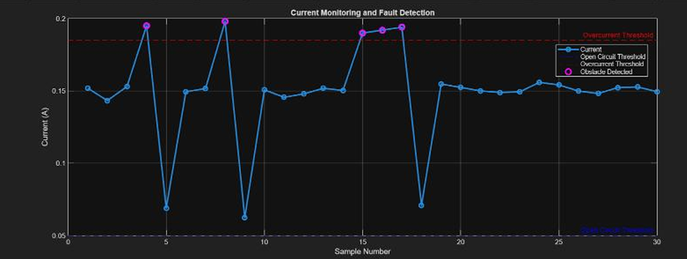
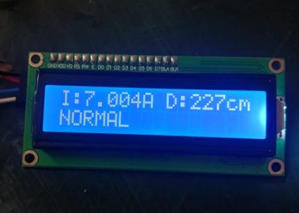
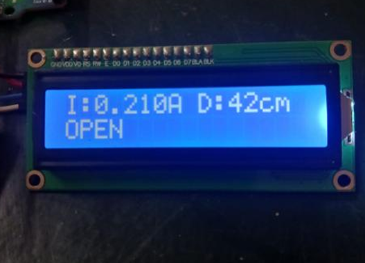
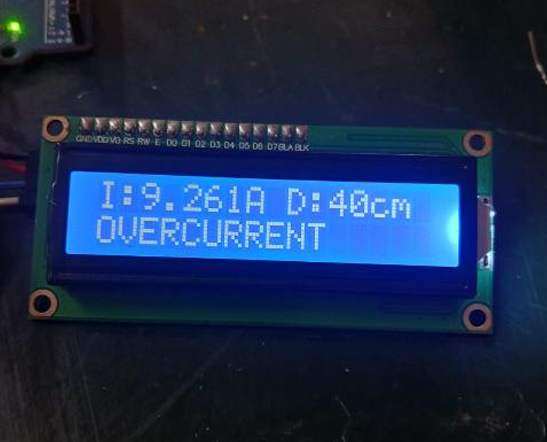
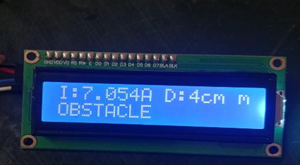
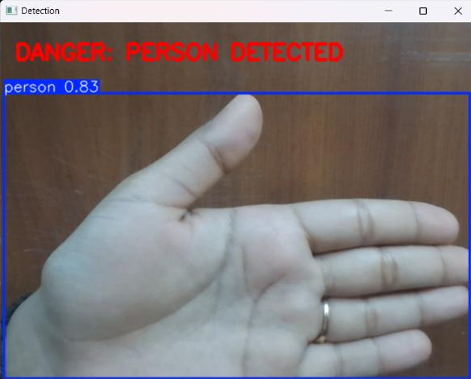
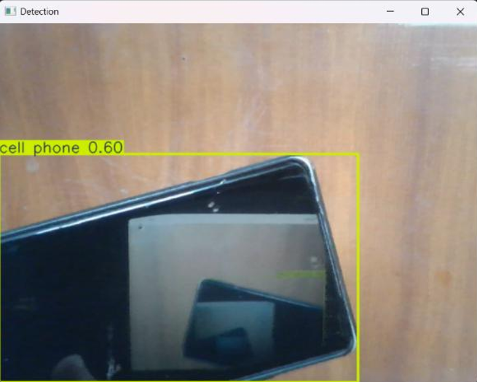

# Low-Cost Embedded System for Electrical Fault Detection and Physical Anomaly Monitoring in Power Lines

## Overview

This project is an affordable embedded system which is developed to monitor and detect faults in power transmission lines.

Conventional electrical fault detection systems can be costly and complicated as well as not suitable for laboratory use. This project is an affordable prototype which makes use of the Arduino Uno as the central embedded controller.

This system has been built through:

- Electrical current measurement by an ACS712 current sensor 
- Proximity measurement by an HC-SR04 ultrasonic sensor 
- Real time status monitoring by 16×2 I2C LCD
- LED based fault identification
- Serial Communication for data monitoring and analysis 
- Real time visualization in MATLAB 
- Vision analysis through machine learning using YOLOv8

The embedded prototype will classify the monitored system into four categories:

- NORMAL 
- OPEN CIRCUIT 
- OVERCURRENT
- OBSTACLE

The project also explores vision-based person detection to provide an additional layer of physical hazard monitoring.

---

#  Objectives

The key goals of this project include:

1. Identification of electrical overcurrent faults.
2. Identification of open circuit faults.
3. Detection of physical proximity to the monitored power-line prototype.
4. Identification of obstacles in the vicinity of the prototype with an ultrasonic sensor.
5. Real-time display of system parameters and fault conditions.
6. Minimization of measurement errors via averaging and filtering of sensor values.
7. Visual identification of faults.
8. Transmission of the sensors’ measurements through serial interface.
9. Visualization of sensors' values via MATLAB.
10. Integration of machine learning-based object recognition with YOLOv8 algorithm.
11. Design of an affordable and safe prototype suitable for educational purposes.

---

#  System Architecture

```text
                         POWER-LINE
                         PROTOTYPE
                              │
                              ▼
                    ┌──────────────────┐
                    │  ACS712 Current  │
                    │      Sensor      │
                    └────────┬─────────┘
                             │
                             │ Analog
                             ▼
                    ┌──────────────────┐
                    │                  │
                    │   ARDUINO UNO    │
                    │                  │
                    │ Fault Detection  │
                    │ Signal Processing│
                    └───────┬──────────┘
                            │
              ┌─────────────┼─────────────┐
              │             │             │
              ▼             ▼             ▼
          HC-SR04        16×2 LCD        LED
       Ultrasonic        Display       Indicator
          Sensor
              │
              ▼
       Distance Measurement

                    Arduino Serial
                           │
                           ▼
                       MATLAB
                           │
                           ▼
                  Data Visualization


                         CAMERA
                           │
                           ▼
                         YOLOv8
                           │
                           ▼
                   Object Detection


```

---

## Hardware Components

| Component | Purpose |
|---|---|
| **Arduino Uno** | Main embedded controller and fault classification |
| **ACS712 Current Sensor** | Measures current flowing through the prototype |
| **HC-SR04 Ultrasonic Sensor** | Measures distance and detects nearby obstacles |
| **16×2 I2C LCD** | Displays current, distance, and system state |
| **LED** | Provides visual indication of detected conditions |
| **Power-Line Prototype** | Provides the monitored electrical test setup |
| **Camera** | Captures the scene for vision-based monitoring |

---

## Hardware Architecture

The physical hardware architecture consists of an Arduino Uno connected to the ACS712 current sensor, HC-SR04 ultrasonic sensor, LCD, and LED indicator.

The ACS712 provides an analog signal proportional to the measured current. The HC-SR04 provides distance information based on the time taken for an ultrasonic pulse to return.

The Arduino processes these measurements and determines the system condition according to predefined calibrated thresholds.


---

## Circuit Diagram

The circuit integrates the Arduino Uno with the current sensor, ultrasonic sensor, LCD, and LED indicator.


---

## Working Principle

The system continuously monitors both the electrical current and the physical surroundings of the power-line prototype.

### 1. Current Measurement

The ACS712 current sensor provides an analog voltage corresponding to the current flowing through the monitored circuit.

The Arduino reads the analog signal and converts it into a current value.

To improve measurement stability, the system:

- Takes multiple sensor samples
- Calculates the average current
- Removes very small values caused by measurement noise

The implementation uses **100 samples** for averaging.

---

### 2. Distance Measurement

The HC-SR04 ultrasonic sensor is used to measure the distance between the sensor and nearby objects.

The Arduino sends a trigger pulse and measures the duration of the returning echo signal.

The measured distance is then used to determine whether an obstacle is present near the monitored prototype.

---

### 3. Fault Classification

The Arduino classifies the system based on current and distance thresholds.

| Condition | Detection Logic |
|---|---|
| **OBSTACLE** | Distance ≤ 15 cm |
| **OPEN CIRCUIT** | Current < 0.05 A |
| **OVERCURRENT** | Current > 0.2 A |
| **NORMAL** | Current within the defined range and no obstacle |

The obstacle condition is checked first, followed by open-circuit and overcurrent conditions.

---

## Fault Indication

Different LED behaviors are used to distinguish between system conditions.

| System State | LED Behavior |
|---|---|
| **NORMAL** | Steady ON |
| **OPEN** | Slow blinking |
| **OVERCURRENT** | Fast blinking |
| **OBSTACLE** | Double blink |

The current system state is also displayed on the 16×2 I2C LCD.

### Example LCD Display

```text
I:0.125A D:25cm
NORMAL
```

---

## Software Implementation

The embedded firmware was developed using the Arduino IDE.

### Main Software Functions

- Analog current sensing
- Current averaging
- Noise removal
- Ultrasonic distance measurement
- Threshold-based fault classification
- LCD status display
- LED fault indication
- Serial data transmission

The main Arduino source code is available here:

[**Arduino Source Code**](Code/power_line_fault_detection.ino)

---

## Calibration and Signal Processing

The ACS712 measurement is calibrated using an experimentally determined offset voltage.

The implementation uses:

```text
Offset Voltage = 2.08 V
ACS712 Sensitivity = 0.185 V/A
```

The current measurement is averaged over 100 samples to reduce fluctuations.

A small-current noise threshold is also applied so that insignificant sensor fluctuations are treated as zero.

---

## Serial Communication

The Arduino transmits the measured current, distance, and detected system state through serial communication.

Example:

```text
I=0.1250A  D=25cm  State=NORMAL
```

This serial data can be monitored and used for further analysis and visualization.

---

## MATLAB Analysis

Serial sensor data can be analyzed and visualized using MATLAB.

MATLAB provides a way to observe the variation of measured parameters and understand the behavior of the prototype under different operating conditions.



---

## YOLOv8 Vision Module

An additional vision-based monitoring layer is incorporated using YOLOv8.

The vision module is intended to detect people near the monitored setup and provide an additional physical hazard indication.

The processing flow is:

```text
Camera
   │
   ▼
YOLOv8
   │
   ▼
Object Detection
   │
   ▼
Person Detected
   │
   ▼
Physical Hazard Indication
```

This complements the electrical sensing system by monitoring the physical environment around the prototype.

---

## Results

The prototype was tested under different operating conditions.

### Normal Condition

The system operates normally when the measured current remains within the defined operating range and no nearby obstacle is detected.



---

### Open Circuit

An open-circuit condition is identified when the measured current falls below the calibrated open-circuit threshold.



---

### Overcurrent

An overcurrent condition is detected when the measured current exceeds the predefined threshold.



---

### Obstacle Detection

The HC-SR04 detects an obstacle when an object is located within the predefined distance limit.



---

### Danger Detection

The vision-based monitoring component provides an additional indication when a person is detected near the monitored setup.



---

### No Danger Condition

The system can also indicate the absence of a detected physical hazard.



---

## Project Results

The developed prototype demonstrates the ability to:

- Monitor electrical current in real time
- Identify low-current/open-circuit conditions
- Identify overcurrent conditions
- Detect nearby physical obstacles
- Display system status through an LCD
- Provide visual fault indication
- Transmit sensor data through serial communication
- Visualize measurements using MATLAB
- Extend monitoring using YOLOv8-based person detection

---

## Project Structure

```text
Power-Line-Fault-Detection/
│
├── Code/
│   └── power_line_fault_detection.ino
│
├── Documentation/
│   ├── Power-Line-Fault-Detection-Project-Report.pdf
│   └── README.md
│
├── Hardware/
│   ├── block_diagram.png
│   └── circuit_diagram.png
│
├── Results/
│   ├── README.md
│   ├── danger_detected.png
│   ├── matlab_analysis.png
│   ├── no_danger.png
│   ├── normal_condition.png
│   ├── obstacle_detection.png
│   ├── open_circuit.png
│   └── overcurrent.png
│
└── README.md
```

---

## Technologies Used

### Hardware

- Arduino Uno
- ACS712 Current Sensor
- HC-SR04 Ultrasonic Sensor
- 16×2 I2C LCD
- LED Indicator
- Power-line prototype
- Camera

### Software

- Arduino IDE
- Embedded C/C++
- MATLAB
- YOLOv8
- Serial Communication

---

## Applications

The developed prototype can be used as an educational demonstration of:

- Embedded fault detection
- Current sensing
- Sensor interfacing
- Real-time monitoring
- Electrical safety monitoring
- Physical obstacle detection
- Serial data acquisition
- MATLAB-based data visualization
- Computer-vision-based hazard detection

The system is intended as a **low-voltage educational prototype** and not as a replacement for industrial power-line protection equipment.

---

## Limitations

- The prototype uses predefined current thresholds for fault classification.
- ACS712 measurements depend on sensor calibration and operating conditions.
- HC-SR04 provides proximity detection rather than electrical fault detection.
- YOLOv8 performance depends on camera conditions and the trained detection model.
- The prototype is designed for educational and laboratory demonstration rather than direct connection to high-voltage transmission infrastructure.

---

## Future Scope

The system can be further improved by:

1. Adding voltage sensing for combined voltage-current monitoring.
2. Integrating additional electrical fault types.
3. Adding wireless communication using ESP32, Wi-Fi, or LoRa.
4. Implementing cloud-based monitoring.
5. Developing a mobile or web dashboard.
6. Improving sensor calibration and measurement accuracy.
7. Using machine learning for automatic electrical fault classification.
8. Improving vision-based hazard detection for different environmental conditions.
9. Adding automatic alerts for detected faults.
10. Developing a more robust industrial-grade protection architecture.

---

## Documentation

The detailed project report containing the complete methodology, implementation, testing, analysis, cost estimation, and future scope is available in the repository.

[**View Project Documentation**](Documentation/Power-Line-Fault-Detection-Project-Report.pdf)

---

## Author

**Tanisha Gupta**

B.Tech — Electronics Engineering  
Specialization in VLSI Design and Technology  
VIT Vellore

---

## Repository

**Power Line Fault Detection and Physical Anomaly Monitoring**

This repository contains the source code, hardware diagrams, project documentation, and experimental results for the developed prototype.
                           │
                           ▼
                  Person Detection
                           │
                           ▼
               "DANGER: PERSON DETECTED"
